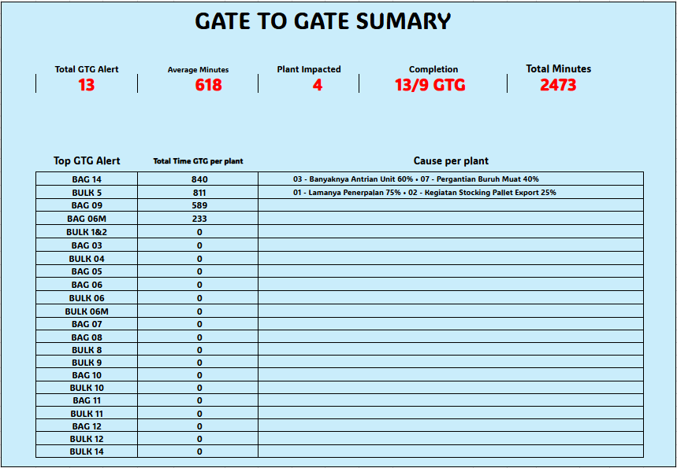

# Gate-to-Gate Daily Monitoring — Workbook Improvement

**PT Indocement Tunggal Prakarsa Tbk. — Divisi Central Dispatch, Departemen Logistik**

> Lihat juga: [v2 — Monthly Evaluation Dashboard](../v2-monthly-evaluation), lanjutan dari project ini.

---

## Latar Belakang

Operator Central Dispatch memantau aktivitas distribusi semen lewat dashboard Tableau secara real-time. Kalau ditemukan Over Time (OT), operator wajib investigasi ke PIC lapangan, lalu mencatat hasilnya ke workbook Excel Online sebagai dokumentasi operasional.

Gak ada project khusus yang ditugaskan di awal Kerja Praktik. Setelah beberapa hari mengamati alur kerja operator, kelihatan bahwa workbook monitoring yang dipakai sehari-hari masih punya banyak kekurangan dari sisi usability. Setelah diskusi dengan karyawan dan dapat konfirmasi bahwa workbook masih bisa dikembangkan, observasi dan pengembangan dilakukan mandiri.

## Masalah

| Masalah | Dampak |
|---|---|
| Scrolling horizontal & vertikal panjang | Monitoring jadi lambat, gak nyaman |
| Area investigasi jauh dari data OT | Operator bolak-balik area tiap input |
| Gak ada indikator visual status investigasi | Investigasi yang belum selesai sulit dikenali |
| Kategori penyebab diketik manual | Typo, penulisan gak konsisten, data sulit dianalisis |
| Dashboard cuma angka mentah | Supervisor gak bisa cepat tau plant paling bermasalah / penyebab dominan |
| Banyak helper formula saling bergantung | Workbook sulit dipelihara oleh pengguna baru |

## Root Cause & Solusi

- **Layout berkembang bertahap tanpa penataan ulang** → redesign layout jadi *one sheet dashboard*, seluruh aktivitas utama (data OT, investigasi, dashboard) dalam satu worksheet, dashboard ditempatkan di bagian atas agar langsung terlihat saat file dibuka.
- **Tidak ada indikator visual** → **Conditional Formatting**: area investigasi berubah warna (merah) kalau ada OT tapi investigasi belum lengkap, kembali normal/hijau kalau sudah selesai.
- **Kategori diketik manual** → **Data Validation** berupa dropdown, sumbernya dari master kategori standar (mis. *01 – Lamanya Penerpalan*, *02 – Kegiatan Stocking Pallet Export*, dst).
- **Dashboard belum informatif** → dashboard KPI: Total OT, Total OT Minutes, Plant Impacted, Completion Investigation, Top Plant, Cause Breakdown.

## Detail Teknis

Seluruh dashboard dan kalkulasi dibangun murni pakai formula Excel Online — **tanpa VBA atau macro**, karena workbook dipakai di lingkungan Microsoft 365 berbasis cloud dan harus tetap kompatibel di Excel Online.

Formula utama yang dipakai: `COUNTIF`, `COUNTIFS`, `SUMIFS`, `IF`, `INDEX`, `MATCH`, `XMATCH`, `XLOOKUP`, `FILTER`, `SORT`, `SORTBY`, `UNIQUE`, `TEXTJOIN`, `LET`, `HSTACK`, `TOCOL`, `CHOOSECOLS`.

Salah satu kendala teknis: `COUNTIF` terhadap array dinamis di Excel Online kadang menghasilkan nilai nol meski data tersedia (beda perilaku dari Excel Desktop). Solusinya dikombinasikan `LET`, `FILTER`, `TOCOL`, `HSTACK`, dan `CHOOSECOLS` untuk dapat hasil yang konsisten.

Konsep dashboard sempat berubah di tengah jalan: awalnya rencana nampilin *Top Cause* secara global (penyebab paling sering muncul di seluruh plant), tapi setelah dievaluasi dianggap kurang membantu keputusan operasional. Diubah jadi **Cause Breakdown berdasarkan Top Plant** — jadi supervisor langsung tau plant dengan OT tertinggi *beserta* distribusi penyebabnya, bukan cuma penyebab umum yang gak terkait plant mana pun.

## Validasi

Workbook diuji langsung dengan meminta operator menggunakannya untuk mensimulasikan monitoring harian. Ditemukan satu kendala pada perhitungan persentase Cause Breakdown yang belum akurat, diperbaiki setelah evaluasi.

Selain itu dilakukan pengujian waktu kecil (n=3, dibandingkan workbook lama vs baru) menunjukkan rata-rata percepatan sekitar 37% dalam proses input investigasi. Catatan metodologi: urutan penggunaan workbook lama/baru saat pengujian tidak diacak, jadi angka ini bersifat indikatif, bukan hasil pengujian terkontrol penuh.

## Sebelum vs Sesudah

| | Sebelum | Sesudah |
|---|---|---|
| Layout | Scroll panjang, area terpisah jauh | Satu worksheet, area utama berdekatan |
| Kategori | Ketik manual | Dropdown standar |
| Status investigasi | Baca satu-satu | Warna otomatis (Conditional Formatting) |
| Dashboard | Angka mentah | KPI + Top Plant + Cause Breakdown |

## Kontribusi Personal

- Observasi proses bisnis & identifikasi masalah secara mandiri (bukan penugasan)
- Analisis workbook existing dan root cause
- Redesign layout, implementasi Data Validation & Conditional Formatting
- Pengembangan seluruh formula dashboard KPI
- Testing dengan operator dan revisi berdasarkan feedback

## Skill yang Terdemonstrasi

Business Process Improvement · Root Cause Analysis · Excel Formula Engineering (`LET`, `FILTER`, `XLOOKUP`, dinamis array) · Visual Management (Conditional Formatting) · Dashboard Design · Usability Testing

## Catatan

Inisiatif mandiri mahasiswa selama Kerja Praktik, disetujui secara informal oleh mentor lapangan dan mendapat apresiasi dari Section Head serta staf Central Dispatch. Data operasional pada screenshot bukan data sensitif dan sudah disetujui untuk ditampilkan secara publik.

## Screenshots

## Screenshots

**Dashboard KPI Harian**

**Dropdown Kategori (Data Validation)**

**Indikator Visual Status Investigasi (Conditional Formatting)**

**Struktur Formula Database**

